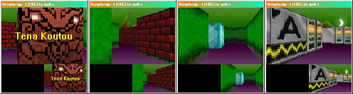



## Simpleray \(basic attemp Wolfenstein 3D\)

### Description

Kia Ora, Simpleray is a Simple Raycasting example. If you have ever seen Wolfenstein 3D or Ken's Labyrinth. This is kindof a basic attempt at it. Coded in about Half-an-hour. (sorry bout the REM/Comments). All VB+API, no DirectX. __Please vote, whether good or bad, any vote is greatly appreciated.__

Keywords: Raycast, 3D, 2D to 3D, Wolfenstein 3d, Bitblt, h24Bitmap, Fish eye effect, fish bowl effect, Maze.
 
### More Info
 

             |
---                |---
**Submitted On**   |2001-05-01 17:17:20
**By**             |[Cory Ului](https://github.com/Planet-Source-Code/PSCIndex/blob/master/ByAuthor/cory-ului.md)
**Level**          |Intermediate
**User Rating**    |4.9 (49 globes from 10 users)
**Compatibility**  |VB 6\.0
**Category**       |[Graphics](https://github.com/Planet-Source-Code/PSCIndex/blob/master/ByCategory/graphics__1-46.md)
**World**          |[Visual Basic](https://github.com/Planet-Source-Code/PSCIndex/blob/master/ByWorld/visual-basic.md)
**Archive File**   |[Simpleray 19057512001\.zip](https://github.com/Planet-Source-Code/cory-ului-simpleray-basic-attemp-wolfenstein-3d__1-22835/archive/master.zip)

